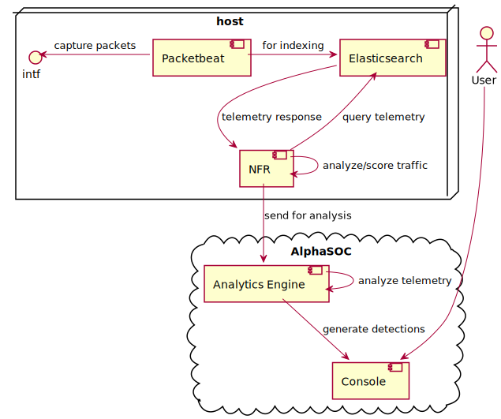

# asoc-elastic

This project provides instructions (this README) for configuring an end-to-end network
threat monitoring solution based on AlphaSOCs [Network Flight Recorder](https://github.com/alphasoc/nfr)
(NFR), Analytics Engine (AE) and Console, along with [Packetbeat](https://www.elastic.co/beats/packetbeat)
and [Elasticsearch](https://www.elastic.co/elasticsearch).  Packetbeat is used to capture
and analyze network packets, the result of which is sent to Elasticsearch for indexing.
NFR then queries Elasticsearch, extracting relevant network telemetry.  It then performs
some initial analysis, scoring the traffic, and sends this data to AE, which further analyzes
it for potential network threats.  Any such detections will be visible, and actionable, in
the AlphaSOC Console.

At the time of writing this guide, Elastic v7.16.2, and NFR v1.11.1 were used.

For details about AE, visit:
[AlphaSOCs Analytics Engine](https://docs.alphasoc.com/ae/architecture/).

**Note** that the instructions provided here are for a local installation, targeted at
evaluating the use of Elastic alongside AlphaSOCs AE and Console.  Integration with
the cloud-based Elasticsearch Service is not covered in this document.

## Architecture

## Who is this for?

If you're an existing AlphaSOC customer and would like to try NFR + Elastic as a network
monitoring solution, this is for you.

If you're not a customer, but are curious about the kinds of threats that AlphaSOC can help
you detect on your network, this is for you as well.

## AlphaSOC Registration

Since this guide focuses on setting up NFR + Elastic to work with AE, an AlphaSOC account
and API key are needed to get started.  If you don't have an account, please visit
[Demo | AlphaSOC](https://alphasoc.com/demo/) and register for one.  The registration
will grant you a **free**, 30 day demo of AlphaSOC services.  You'll receive an email
with a verification link.  Be sure to verify the account before continuing.

Once you have an account, please visit: [Console | AlphaSOC](https://console.alphasoc.net)
and sign in with your credentials.  Then, head over to the [credentials](https://console.alphasoc.net/credentials)
page and in the _API Keys_ pane, create a new API key by clicking _**+ New API Key**_, setting a
description for the key if you wish, and clicking **_Generate_**.

**Be sure to copy the API key at this point to your clipboard for later use!  You will not
be able to copy it later on and will need to generate a new key.**

**NOTE:** If you're an AlphaSOC developer using the staging variant of AlphaSOC services,
see the [Developers](#developers) section before continuing on.

## Installation

This section will cover local installation of Elasticsearch, Packetbeat and NFR.  For clarity,
further sections in this guide assume that you installed each component locally and directly in
your home directory.  Other installation options are presented for your reference.

### Elasticsearch

Elasticsearch installation instructions can be found
[here](https://www.elastic.co/downloads/elasticsearch).  You can choose to download a
pre-built package for your platform, or use a package repository.

### Packetbeat

In a similar fashion, Packetbeat installation instructions can be found
[here](https://www.elastic.co/downloads/beats/packetbeat).  Again, you can choose to download
a pre-built package, or use a package repository.

### NFR

To install NFR, visit the NFR [releases](https://github.com/alphasoc/nfr/releases) page on GitHub.
There you will find Debian and RPM packages, as well as zipped archives (tarballs) containing
pre-built NFR binaries for Debian and Centos based Linux distributions, and for Windows.
Download an appropriate package.

If you downloaded a `.deb` or `.rpm`, use your system's package management utility to install
the package.  As part of installation, an NFR configuration file will be installed to
`/etc/nfr/config.yml`.

If you downloaded a Linux or Windows tarball, start by creating a directory where NFR will reside.
For example, under your home directory, create an `nfr` folder/directory.  Untar the contents
of the NFR tarball to this new `nfr` directory.  Finally, download the sample
[config.yml](https://raw.githubusercontent.com/alphasoc/nfr/master/config.yml) and copy it to
the `nfr` directory.

If a package is not available for your system, or if you want to build NFR from source, you will
need a Go compiler.  Go installation is covered [here](https://go.dev/doc/install).  Assuming
you have Go installed, you can clone the NFR Git [repositry](https://github.com/alphasoc/nfr.git),
change to the repository root directory, and build NFR.  Note that a `config.yml` will be present
in the repository root directory.

## Configuration

This section will cover configuration of Elasticsearch, Packetbeat and NFR.  To help with clarity,
the following assumptions will be made:

1. `~/` represents your user home directory
1. `$ELASTIC_VER` represents the Elastic version
1. Elasticsearch has been installed locally to `~/elasticsearch-$ELASTIC_VER`
1. Packetbeat has been installed locally to `~/packetbeat-$ELASTIC_VER`
1. NFR has been installed locally to `~/nfr`, and a vanilla `config.yml` is present

If this is not the case for you, please augment the instructions in this section to fit your
installation locations.

### Packetbeat

The goal is to get Packetbeat to capture packets on a given interface, and relay the resulting
telemetry to Elasticsearch for indexing.  Open `~/packetbeat-$ELASTIC_VER/packetbeat.yml` in your
favourite text editor and make the following changes:

1. Select a network interface from which to capture packets.

        # =============================== Network device ===============================
        
        # Select the network interface to sniff the data. On Linux, you can use the
        # "any" keyword to sniff on all connected interfaces.
        packetbeat.interfaces.device: YOUR_SELECTED_INTF

1. Packbeat will output to Elasticsearch, which will run on `localhost:9200`.  For simplicity,
username and password authentication will be used, along with the default credentials as below.

        # ---------------------------- Elasticsearch Output ----------------------------
        output.elasticsearch:
          # Array of hosts to connect to.
          hosts: ["localhost:9200"]
        
          # Protocol - either `http` (default) or `https`.
          #protocol: "https"
        
          # Authentication credentials - either API key or username/password.
          #api_key: "id:api_key"
          username: "elastic"
          password: "changeme"

1. At the very bottom of the _Processors_ section, add the `convert` directive as below.  This,
as documented in the config snippet below, is needed for NFR queries.  Read the note below if
you're curious why.

        # ================================= Processors =================================
        
        processors:
          - # Add forwarded to tags when processing data from a network tap or mirror.
            if.contains.tags: forwarded
            then:
              - drop_fields:
                  fields: [host]
            else:
              - add_host_metadata: ~
          - add_cloud_metadata: ~
          - add_docker_metadata: ~
          - detect_mime_type:
              field: http.request.body.content
              target: http.request.mime_type
          - detect_mime_type:
              field: http.response.body.content
              target: http.response.mime_type
          # For NFR queries.
          - convert:
              fields:
                - { from: "event.start", to: "event.ingested" }

    **NOTE:** The `ingested` field is an [event](https://www.elastic.co/guide/en/beats/packetbeat/current/exported-fields-ecs.html#_event_2)
    field as defined by the Elastic Common Schema (ECS).  It marks the time at which an event
    arrived at the central store.  It's related to the `created` field, which marks the time
    at which an event was first seen by an _agent_ (ie. Packetbeat).  At the time of writing
    this guide, these fields were not present in the events indexed by Elasticsearch, nor was
    the author able to determine why.  Since the `ingested` field is used by NFR to query
    Elasticsearch, this workaround was introduced.

### Elasticsearch

The goal is to get Elasticsearch to accept telemetry data from Packetbeat.  All that's needed
is for Elasticsearch to be configured to run on `localhost:9200`.  In fact, these are presently
the default settings.  No modifications to `~/elasticsearch-$ELASTIC_VER/config/elasticsearch.yml`
should be needed.  Simply ensure that you don't have any process using port `9200` on your host.

### NFR

The goal is to get NFR to extract network telemetry indexed by Elasticsearch.  NFR will then
analyze, score and send this telemtetry to AlphaSOCs Analytics Engine for network threat
analysis.  Open `~/nfr/config.yml` and make the following changes:

1. Set your API key (obtained in the [AlphaSOC Registration](#alphasoc-registration) section.

        # Your AlphaSOC API key (required to use the service)
        # Use "nfr account register" to generate one
        api_key: YOUR_ALPHASOC_API_KEY

1. Under the _inputs_ section, enable the `elastic` input method, set the host where Elasticsearch
will run (ie. `localhost:9200`, and assign the `username` and `password`.

        inputs:
          ...
          elastic:
            # Set to true to retrieve telemetry from elasticsearch
            # Default: false
            enabled: true
        
            # Either cloud_id or hosts are required. You can find your
            # Cloud ID at https://cloud.elastic.co/deployments/
            # cloud_id:
            hosts:
              - http://localhost:9200
        
            # Use an API key (recommended) or username/password to authorize to the
            # elastic search instance. Find out more about API Keys here:
            # https://cloud.elastic.co/deployment-features/keys
            # api_key:
            username: elastic
            password: changeme

1. Next, under the `elastic` input method, there will be a `searches` field with multiple
`event_type` fields.  Each event type (ie. dns, ip, http, and tls) will have a field specifying
the Elasticsearch index to query.  Set this to a wildcard (ie. *) match of the default index
name used by Packetbeat, as below.

        inputs:
        ...
        elastic:
        ...
          searches:
            # Define your searches, one per event type (dns, ip, http, tls). At least
            # one search is required.
            - event_type: dns
            ...
              # Indices to search. Wildcards are allowed.
              indices:
                - packetbeat-*
            ...
            - event_type: ip
              indices:
                - packetbeat-*
            ...
            - event_type: http
              indices:
                - packetbeat-*
            ...
            - event_type: tls
              indices:
                - packetbeat-*

1. Lastly, modify the location where NFR will store local data.  The example below shows
Linux defaults (ie. `/var/run`).

        ################################################################################
        # Internal NFR data location
        ################################################################################
        
        data:
          # Define the file for internal data and caching
          # Default:
          #  - linux: /run/nfr.data
          #  - windows: %AppData%/nfr.data
          file: /run/nfr.data
          # If you use elastic input, define the directory for
          # internal bookkeeping and caching
          # Default:
          # - linux: /run/nfr
          # - windows: %AppData%/nfr
          dir: /run/nfr/data
        

**NOTE:** If you're an AlphaSOC developer using the staging variant of AlphaSOC services,
see the [Developers](#developers) section before continuing on.

## Startup

This section will present a manual run of all three software components.  By default, Packetbeat,
Elasticsearch and NFR, all log to standard out/error.  This guide assumes each program will be
run in a separate console/terminal.  Again, if you installed any of these packages to a location
other than that specified in this guide, your startup commands may differ.

### Elasticsearch

Change to `~/elasticsearch-$ELASTIC_VER/bin`, and start `elasticsearch`.

    ./elasticsearch

You can trace the output to see when Elasticsearch has started before continuing on.  Alternatively,
you can wait a minute, and periodically try to access `http://localhost:9200` (ie. via a web browser,
`curl`, etc).

### Packetbeat

Change to `~/packetbeat-$ELASTIC_VER`, and start `packetbeat`, feeding it the location of its config
file.

    ./packetbeat -e -c ./packetbeat.yml

After a few moments, you should see the following being logged to the console:

    INFO    [publisher_pipeline_output]     pipeline/output.go:151  Connection to backoff(elasticsearch(http://localhost:9200)) established

You can also verify Packetbeat is up by ensuring an index has been created in the Elasticsearch
data store.  This can be done by querying `http://localhost:9200/_cat/indices`.  You should see
an index similar to the one below.

    yellow open packetbeat-7.16.2-2021.12.29-000001 tn6IQHIaTDmp6FYxsUirEg 1 1 598 0 729.8kb 729.8kb

### NFR

Change to `~/nfr` and start `nfr`, feeding it the location of it's config file.

    ./nfr start -c config.yml

Assuming the default info logging level has not been modified in `config.yml`, you should
start to see something like the following being logged to the console:

    INFO[2021-12-29T13:14:31+01:00] starting the polling mechanism to check for new alerts
    ...
    INFO[2021-12-29T13:14:31+01:00] telemetry sent                                events=8 lastIngested=2021-12-29 13:13:27.214 +0000 UTC name=dns-000

Congratulations!  At this point, Packbeat is capturing packets, Elasticsearch is indexing, NFR
is querying, scoring and sending the telemetry to AlphaSOCs AE, where it is being analyzed
for potential network threats.

## The AlphaSOC Console

**NOTE:** If you're an AlphaSOC developer using the staging variant of AlphaSOC services,
see the [Developers](#developers) section before continuing on.

Head on over to [Console | AlphaSOC](https://console.alphasoc.net), and sign in with your
credentials.  In the main _Dashboard_, you should see _Telemetry Sources_ having recently
been updated.

## Testing AlphaSOC Threat Detection

With Packetbeat, Elasticsearch and NFR running and sending telemetry to AlphaSOC,
you can now begin generating some simulated, malicious traffic, in order to see the kinds
of network threats AlphaSOC detects.  The simplest way to generate such traffic, is to
download AlphaSOCs [Network Flight Simulator](https://github.com/alphasoc/flightsim)
and run the suite of simulations on the same system where you're capturing and relaying
telemetry.  You can build `flightsim` from source (a Go compiler will be needed), or
download one of binary packages from the
[latest release](https://github.com/alphasoc/flightsim/releases/latest) page.

For an overview of how to use `flightsim`, and assuming a local installation,
change to the directory where flightsim has been untarred, and run as:

    $ ./flightsim -h

To see a list of simulations that can be run, try:

    $ ./flightsim run -h

To run all available modules, run:

    $ ./flightsim run

Finally, visit [Console | AlphaSOC](https://console.alphasoc.net/) and in the _Dashboard_
an overview of detected network threats should be availalbe.  For a more detailed view,
visit the Consoles [Detections](https://console.alphasoc.net/detections) page.

## Developers

If you're an AlphaSOC developer using staging variants of AlphaSOC services, you will want
to replace all instances of alphasoc.net with staging.alphasoc.net.  Specifically, you will
want to access the staging Console: [Console | AlphaSOC](https://console.alphasoc.net/).

Also, in your NFR configuration, you want to add:

    engine:
      # Location of the AlphaSOC Analytics Engine
      # This is a URI and defaults to the AlphaSOC cloud. Please contact
      # support@alphasoc.com to discuss on-premise operation and VM setup.
      # Default: https://api.alphasoc.net
      host: https://api.staging.alphasoc.net

## Where to go from here?

TBD
- security/hardening

## Troubleshooting

TBD
